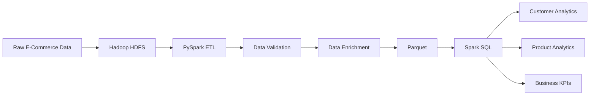
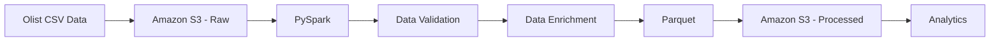

# 🛒 E-Commerce Big Data Analytics Platform

[](https://www.python.org/)
[](https://spark.apache.org/)
[](https://spark.apache.org/)
[](https://hadoop.apache.org/)
[](https://spark.apache.org/sql/)
[](https://github.com/)

> An end-to-end Big Data engineering platform for ingesting, cleaning,
> transforming and analyzing e-commerce data using Hadoop HDFS, Apache
> Spark, PySpark, Spark SQL and Parquet.

## The project is being developed incrementally: starting with a local Hadoop/Spark environment to understand distributed data processing fundamentals, then extending the pipeline to AWS S3 and later to Databricks.

## Project Overview

This project simulates a real-world e-commerce data engineering pipeline
that processes order data and produces business-level analytics.

The current implementation demonstrates the complete flow from raw data
ingestion through transformation and analytical processing.

### Current Pipeline

``` text
                    RAW DATA
                       │
                       ▼
                 Hadoop HDFS
                       │
                       ▼
                PySpark ETL
                       │
              ┌────────┴────────┐
              │                 │
              ▼                 ▼
        Data Cleaning      Data Enrichment
              │                 │
              └────────┬────────┘
                       ▼
                  Parquet
                       │
                       ▼
                  Spark SQL
                       │
          ┌────────────┼────────────┐
          ▼            ▼            ▼
      Customer      Product      Business
      Analytics     Analytics       KPIs

## Architecture

### Current Implementation

The current pipeline runs locally using Hadoop HDFS and Apache Spark.



### Data Processing Flow

``` text
Raw Data
   │
   ▼
HDFS
   │
   ▼
PySpark
   │
   ├── Data Cleaning
   │
   ├── Data Validation
   │
   └── Data Enrichment
   │
   ▼
Parquet
   │
   ▼
Spark SQL
   │
   ├── Customer Analytics
   ├── Product Analytics
   └── Business KPIs
```

### AWS S3 Integration

The current pipeline has been extended to use Amazon S3 as the cloud
storage layer. Raw Olist CSV datasets are stored in S3, loaded by
PySpark using the S3A filesystem, validated and enriched, and then
written back to S3 as Parquet.



### Planned Cloud Architecture

The next cloud extension is Databricks and lakehouse-based analytics.


## Current Features

### Data Ingestion

-   Read raw e-commerce order data from Hadoop HDFS.
-   Support CSV input with schema inference.
-   Separate raw and processed data layers.

### Data Quality & Cleaning

-   Remove records with missing customer IDs.
-   Remove orders with invalid quantities.
-   Remove orders with invalid prices.
-   Remove duplicate order IDs.
-   Apply reusable PySpark cleaning functions.

### Data Transformation

-   Calculate order-level `total_amount`.
-   Convert cleaned data into Parquet format.
-   Read processed Parquet data back from HDFS.

### Analytics

-   Customer revenue analysis.
-   Customer order-count analysis.
-   Average order value calculation.
-   Product sales analysis.
-   Product revenue analysis.
-   Overall business KPIs.

### Spark SQL

-   Create temporary views from processed datasets.
-   Execute SQL-based analytical queries.
-   Aggregate and sort datasets using Spark.

### Big Data Concepts Demonstrated

-   Hadoop HDFS
-   Apache Spark
-   PySpark DataFrames
-   Spark SQL
-   Parquet
-   Data partitioning
-   Shuffle operations
-   Distributed data processing
-   ETL pipeline design
-   Data quality validation

## Technology Stack

  Technology         Purpose
  ------------------ ------------------------------------------------
  **Python**         Application and data-processing language
  **PySpark**        Distributed data processing and ETL
  **Apache Spark**   Processing engine for large-scale analytics
  **Hadoop HDFS**    Distributed storage for raw and processed data
  **Spark SQL**      SQL-based analytical processing
  **Parquet**        Columnar storage format for processed data
  **Git & GitHub**   Version control and project collaboration
  **VS Code**        Development environment

### Cloud Technologies

  -----------------------------------------------------------------------
  Technology              Status                  Purpose
  ----------------------- ----------------------- -----------------------
  **AWS S3**              Implemented             Cloud object storage
                                                  for raw CSV and
                                                  processed Parquet data

  **Databricks**          Planned                 Managed Spark and
                                                  lakehouse platform

  **Delta Lake**          Planned                 Reliable lakehouse
                                                  storage layer

  **Databricks SQL**      Planned                 Cloud-based analytical
                                                  queries
  -----------------------------------------------------------------------

## Project Structure

``` text
ecommerce-big-data-platform/
│
├── data/
│   ├── raw/                 # Raw input datasets
│   └── sample/              # Small sample datasets
│
├── notebooks/
│   └── 01_spark_basics.ipynb
│                            # Spark experimentation and learning
│
├── src/
│   ├── ingestion/
│   │   └── read_data.py     # Data ingestion
│   │
│   ├── transformation/
│   │   └── cleaning.py      # Data cleaning and validation
│   │
│   ├── analytics/
│   │   └── customer_analysis.py
│   │                            # Business analytics
│   │
│   ├── utils/
│   │   └── spark_session.py # SparkSession creation
│   │
│   └── main.py              # Main ETL pipeline
│
├── tests/                   # Test cases
│
├── config/                  # Pipeline configuration
│
├── docs/
│   ├── architecture.md
│   ├── data-flow.md
│   ├── technology-decisions.md
│   └── performance.md
│
├── diagrams/
│   ├── architecture.mmd
│   └── data-flow.mmd
│
├── screenshots/
│   ├── spark-ui/
│   └── databricks/
│
├── README.md
├── requirements.txt
└── .gitignore
```

### Directory Responsibilities

  Directory              Responsibility
  ---------------------- --------------------------------------------
  `src/ingestion`        Reads source data into Spark
  `src/transformation`   Cleans and transforms datasets
  `src/analytics`        Contains business analytics logic
  `src/utils`            Reusable Spark utilities
  `notebooks`            Interactive Spark experimentation
  `tests`                Automated tests
  `config`               Pipeline configuration
  `docs`                 Technical documentation
  `diagrams`             Architecture and data-flow diagrams
  `screenshots`          Evidence of Spark UI and future cloud work

## How to Run

### Prerequisites

The current pipeline requires:

-   Linux
-   Python 3.x
-   Java 17
-   Hadoop HDFS
-   Apache Spark 4.2.0
-   PySpark

### 1. Start Hadoop

Start the required Hadoop services and verify that HDFS is available.

``` bash
jps
```

The Hadoop services should be running before executing the Spark
pipeline.

### 2. Activate the PySpark Environment

``` bash
source /home/pranav/bigdata/venvs/pyspark-env/bin/activate
```

### 3. Navigate to the Project

``` bash
cd "/media/pranav/New Volume/TechStacks/VS code/Spark"
```

### 4. Run the Spark Pipeline

``` bash
cd src
python main.py
```

The pipeline will:

1.  Read raw order data from HDFS.
2.  Apply data-quality rules.
3.  Calculate `total_amount`.
4.  Write processed data to Parquet.
5.  Read the processed Parquet data.
6.  Execute customer and business analytics.

### 5. Verify the HDFS Output

The processed dataset is stored at:

``` text
/ecommerce/processed/orders
```

You can verify the output using:

``` bash
hdfs dfs -ls /ecommerce/processed/orders
```

### Spark UI

While the application is running, Spark's web interface can be accessed
at:

``` text
http://localhost:4040
```

The Spark UI can be used to inspect:

-   Jobs
-   Stages
-   Tasks
-   SQL queries
-   Shuffle operations
-   Execution details

> **Note:** The exact Hadoop startup commands depend on the local Hadoop
> configuration. The project documentation focuses on the Spark pipeline
> itself.

## Data Quality & Validation

The pipeline processes an intentionally dirty dataset to demonstrate
common data-quality problems encountered in data engineering workflows.

### Validation Rules

  Rule                    Action
  ----------------------- ------------------
  `customer_id` is NULL   Remove record
  `quantity <= 0`         Remove record
  `price <= 0`            Remove record
  Duplicate `order_id`    Remove duplicate

### Example

The raw dataset contains **9 records**.

After applying the validation and cleaning rules:

``` text
Raw Records       : 9
Valid Records     : 5
Invalid/Removed   : 4
```

The cleaned dataset is then enriched with:

``` text
total_amount = quantity × price
```

The resulting dataset is stored in HDFS as Parquet and used for
downstream analytics.

### Validation Checks

The pipeline also verifies that the processed dataset does not contain:

-   Invalid quantities
-   Invalid prices
-   Missing customer IDs
-   Duplicate order IDs

This ensures that downstream analytical queries operate on validated
data.

## Roadmap

### Completed

-   [x] Hadoop HDFS integration
-   [x] PySpark ingestion
-   [x] Data cleaning and validation
-   [x] Parquet processing layer
-   [x] Spark SQL analytics
-   [x] AWS S3 raw data storage
-   [x] AWS S3 processed Parquet storage
-   [x] S3A integration with PySpark
-   [x] Modular project structure
-   [x] GitHub documentation

### Planned

-   [ ] Databricks implementation
-   [ ] Delta Lake
-   [ ] Databricks SQL
-   [ ] Dashboard integration
-   [ ] Pipeline orchestration
-   [ ] Performance benchmarking

## Documentation

Detailed technical documentation is available in the [`docs/`](docs/)
directory.

-   [Architecture](docs/architecture.md) --- System architecture and
    cloud architecture
-   [Data Flow](docs/data-flow.md) --- Data ingestion, validation,
    transformation and processing flow
-   [Technology Decisions](docs/technology-decisions.md) --- Technology
    choices and design principles
-   [Performance Analysis](docs/performance.md) --- Spark execution and
    performance observations

## License

This project is intended for educational and portfolio purposes.
