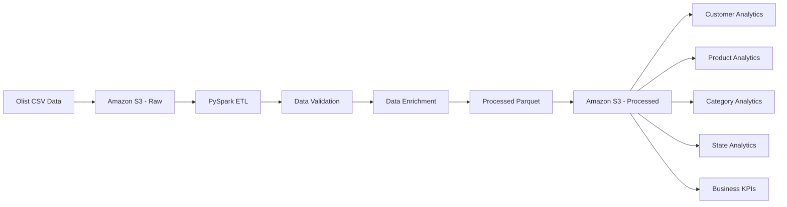

# 🛒 E-Commerce Big Data Analytics Platform

[](https://www.python.org/)
[](https://spark.apache.org/)
[](https://spark.apache.org/)
[](https://hadoop.apache.org/)
[](https://aws.amazon.com/s3/)[](https://github.com/)

> An end-to-end Big Data engineering platform for ingesting, validating,
> transforming and analyzing e-commerce data using Apache Spark, PySpark,
> Amazon S3 and Parquet.

## The project was developed incrementally, starting with a local Hadoop/Spark environment to understand distributed data processing fundamentals, then extending the pipeline to Amazon S3. Databricks and lakehouse analytics are planned as the next stage.

## Project Overview

This project simulates a real-world e-commerce data engineering pipeline
that processes order data and produces business-level analytics.

The current implementation demonstrates the complete flow from raw data
ingestion through transformation and analytical processing.

### Current Pipeline

```text
                 OLIST DATASET
                      │
                      ▼
              Amazon S3 - Raw
                      │
                      ▼
                  PySpark
                      │
              ┌───────┴───────┐
              ▼               ▼
        Data Validation   Data Enrichment
              │               │
              └───────┬───────┘
                      ▼
              Processed Parquet
                      │
                      ▼
            Amazon S3 - Processed
                      │
                      ▼
                  Analytics
              ┌───────┼───────┐
              ▼       ▼       ▼
          Customer  Product  Business
          Analytics Analytics   KPIs
```
## Architecture

### Current Implementation

The current Olist pipeline uses Amazon S3 as the cloud storage layer and
Apache Spark for distributed data processing.



### Data Processing Flow

```text
Olist CSV Data
      │
      ▼
Amazon S3 - Raw
      │
      ▼
PySpark
      │
      ├── Filter Delivered Orders
      │
      ├── Data Validation
      │
      ├── Join Orders
      │      ├── Customers
      │      ├── Order Items
      │      └── Products
      │
      └── Data Enrichment
             │
             ▼
      Processed Parquet
             │
             ▼
      Amazon S3 - Processed
             │
             ▼
         Analytics
             │
      ┌──────┼───────┬────────┐
      ▼      ▼       ▼        ▼
   Customer Product Category State
   Revenue  Revenue Revenue  Revenue
             │
             ▼
       Business KPIs
```

### AWS S3 Integration

The current pipeline uses Amazon S3 as the primary cloud
storage layer. Raw Olist CSV datasets are stored in S3, loaded by
PySpark using the S3A filesystem, validated and enriched, and then
written back to S3 as Parquet.


### Databricks

The project was also executed and validated using Databricks Serverless
Spark. The Olist datasets were uploaded to a Unity Catalog Volume and
the PySpark transformations and analytics were executed in a Databricks
notebook.

The Databricks execution reproduced the core pipeline results, including
110,197 enriched rows and the business revenue metrics.

## Current Features

### Data Ingestion

- Read Olist datasets from Amazon S3 using the S3A filesystem.
- Support CSV input with schema inference.
- Maintain separate raw and processed data layers.
- Process orders, customers, order items and products.

### Data Quality & Cleaning

-   Remove records with missing customer IDs.
-   Remove orders with invalid quantities.
-   Remove orders with invalid prices.
-   Remove duplicate order IDs.
-   Apply reusable PySpark cleaning functions.

### Data Transformation

- Filter orders to delivered transactions.
- Join orders with order items.
- Join product and customer information.
- Calculate `total_item_cost` using product price and freight.
- Write the enriched dataset as Parquet.
- Read processed Parquet data back from Amazon S3.

### Analytics

- Customer revenue analysis.
- Customer order-count analysis.
- Average order value calculation.
- Product revenue analysis.
- Product order analysis.
- Category revenue analysis.
- State-level revenue analysis.
- Overall business KPIs.

### Spark SQL Exploration

-   Create temporary views from Spark DataFrames.
-   Execute SQL-based analytical queries.
-   Explore Aggregation and sorting datasets using Spark SQL.

### Big Data Concepts Demonstrated

-   Apache Spark
-   PySpark DataFrames
-   Spark SQL
-   Amazon S3
-   S3A filesystem
-   Parquet
-   Hadoop HDFS
-   Data partitioning
-   Shuffle operations
-   Distributed data processing
-   ETL pipeline design
-   Data quality validation

## Technology Stack

  Technology         Purpose
  ------------------ ------------------------------------------------
  **Python**         Application and data-processing language
  **PySpark**        Distributed data processing and ETL
  **Apache Spark**   Processing engine for large-scale analytics
  **Amazon S3**      Cloud object storage for raw and processed data
  **Databricks**     Serverless Spark execution and analytics
  **Spark SQL**      SQL-based analytical processing
  **Parquet**        Columnar storage format for processed data
  **Hadoop HDFS**    Local distributed storage used during the initial development phase
  **Git & GitHub**   Version control and project collaboration
  **VS Code**        Development environment

### Cloud Technologies

  -----------------------------------------------------------------------
  Technology              Status                  Purpose
  ----------------------- ----------------------- -----------------------
  **AWS S3**              Implemented             Cloud object storage
                                                  for raw CSV and
                                                  processed Parquet data

  **Databricks**          Planned                 Managed Spark and
                                                  lakehouse platform

  **Delta Lake**          Planned                 Reliable lakehouse
                                                  storage layer

  **Databricks SQL**      Planned                 Cloud-based analytical
                                                  queries
  -----------------------------------------------------------------------

## Project Structure

```text
ecommerce-big-data-platform/
│
├── data/
│   ├── raw/
│   └── sample/
│
├── notebooks/
│   ├── 01_spark_basics.ipynb
│   └── 02_olist_data_exploration.ipynb
│
├── src/
│   ├── ingestion/
│   │   ├── read_data.py
│   │   └── read_olist_data.py
│   │
│   ├── transformation/
│   │   ├── cleaning.py
│   │   └── olist_transformations.py
│   │
│   ├── analytics/
│   │   ├── customer_analysis.py
│   │   └── olist_analysis.py
│   │
│   ├── validation/
│   │   └── olist_validation.py
│   │
│   ├── utils/
│   │   └── spark_session.py
│   │
│   ├── main.py
│   └── main_olist.py
│
├── tests/
│   ├── test_cleaning.py
│   └── test_validation.py
│
├── config/
│
├── docs/
│   ├── architecture.md
│   ├── data-flow.md
│   ├── technology-decisions.md
│   ├── performance.md
│   └── aws-architecture.md
│
├── diagrams/
│   ├── architecture.mmd
│   ├── data-flow.mmd
│   └── aws-architecture.mmd
│
├── screenshots/
│   ├── spark-ui/
│   └── databricks/
│
├── README.md
├── requirements.txt
├── pytest.ini
└── .gitignore
```

### Directory Responsibilities

  Directory              Responsibility
  ---------------------- --------------------------------------------
  `src/ingestion`        Reads source data into Spark
  `src/transformation`   Cleans and transforms datasets
  `src/analytics`        Contains business analytics logic
  `src/utils`            Reusable Spark utilities
  `notebooks`            Interactive Spark experimentation
  `tests`                Automated tests
  `config`               Pipeline configuration
  `docs`                 Technical documentation
  `diagrams`             Architecture and data-flow diagrams
  `screenshots`          Evidence of Spark UI and future cloud work

## How to Run

### Prerequisites

The current pipeline requires:

-   Linux
-   Python 3.x
-   Java 17
-   Apache Spark 4.2.0
-   PySpark
-   AWS CLI
-   An AWS account with access to the project S3 bucket

### 1. Activate the PySpark Environment

``` bash
source /home/pranav/bigdata/venvs/pyspark-env/bin/activate
```

### 2. Navigate to the Project

``` bash
cd "/media/pranav/New Volume/TechStacks/VS code/Spark"
```

### 3. Run the Spark Pipeline

``` bash
cd src
python main_olist.py
```

The older pipeline was:

1.  Read raw order data from HDFS.
2.  Apply data-quality rules.
3.  Calculate `total_amount`.
4.  Write processed data to Parquet.
5.  Read the processed Parquet data.
6.  Execute customer and business analytics.

The New Pipeline will :
1. Read Olist datasets from Amazon S3.
2. Filter delivered orders.
3. Join orders, customers, order items and products.
4. Apply data-quality validation.
5. Create the enriched transaction dataset.
6. Write the processed dataset as Parquet to Amazon S3.
7. Read the processed Parquet data back from S3.
8. Perform customer, product, category and state analytics.
9. Calculate overall business metrics.


### 4. Verify the S3 Output

The processed Parquet dataset is stored in Amazon S3 at:

```text
s3://olist-bigdata-project-2026-8472/processed/olist/
```

You can verify the output using:

``` bash
aws s3 ls s3://olist-bigdata-project-2026-8472/processed/olist/
```

### Spark UI

While the application is running, Spark's web interface can be accessed
at:

``` text
http://localhost:4040
```

The Spark UI can be used to inspect:

-   Jobs
-   Stages
-   Tasks
-   SQL queries
-   Shuffle operations
-   Execution details

> **Note:** The exact Hadoop startup commands depend on the local Hadoop
> configuration. The project documentation focuses on the Spark pipeline
> itself.

### Olist Data Quality & Validation

The Olist pipeline includes reusable data-quality checks to validate the
enriched transaction dataset before downstream analytics.

### Validation Rules

- Required columns must be present.
- Required identifiers must not contain NULL values.
- Price and freight values must not be negative.
- The processed dataset must contain a minimum expected number of rows.

### Validation Result

The Olist pipeline successfully validated the enriched dataset containing
110,197 delivered order-item records.

### Validation Checks

The pipeline also verifies that the processed dataset does not contain:

-   Invalid quantities
-   Invalid prices
-   Missing customer IDs
-   Duplicate order IDs

This ensures that downstream analytical queries operate on validated
data.

## Roadmap

### Completed

-   [x] Hadoop HDFS integration
-   [x] PySpark ingestion
-   [x] Data cleaning and validation
-   [x] Parquet processing layer
-   [x] Spark SQL exploration
-   [x] AWS S3 raw data storage
-   [x] AWS S3 processed Parquet storage
-   [x] S3A integration with PySpark
-   [x] Modular project structure
-   [x] GitHub documentation
-   [x] Databricks implementation

### Planned
-   [ ] Delta Lake
-   [ ] Databricks SQL
-   [ ] Dashboard integration
-   [ ] Pipeline orchestration
-   [ ] Performance benchmarking

## Documentation

Detailed technical documentation is available in the [`docs/`](docs/)
directory.

-   [Architecture](docs/architecture.md) --- System architecture and
    cloud architecture
-   [Data Flow](docs/data-flow.md) --- Data ingestion, validation,
    transformation and processing flow
-   [Technology Decisions](docs/technology-decisions.md) --- Technology
    choices and design principles
-   [Performance Analysis](docs/performance.md) --- Spark execution and
    performance observations

## License

This project is intended for educational and portfolio purposes.
