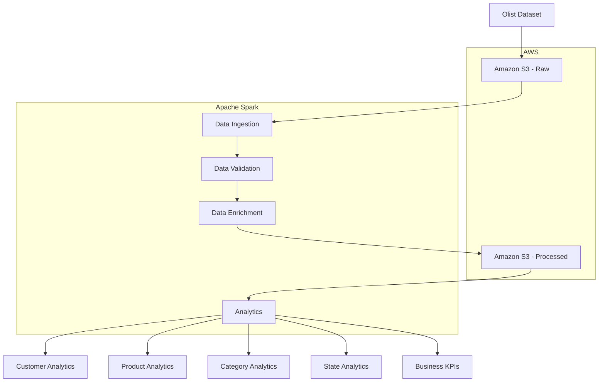
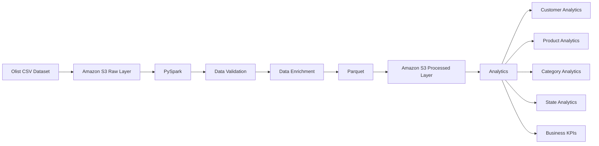

# System Architecture

## Overview

The E-Commerce Big Data Analytics Platform was developed incrementally.

The project initially used a local Hadoop HDFS and Apache Spark environment to understand distributed data processing concepts. The pipeline was later extended to Amazon S3 for cloud-based storage.

The current implementation uses Amazon S3 as the storage layer and Apache Spark/PySpark as the processing engine.

---

## Architecture Evolution

### Phase 1 — Local Development

The initial implementation focused on learning the fundamentals of distributed data processing.

```text
Raw Data
   │
   ▼
Hadoop HDFS
   │
   ▼
PySpark
   │
   ├── Cleaning
   ├── Transformation
   └── Analytics
   │
   ▼
Parquet
```

This phase was used to understand:

- Hadoop HDFS
- Spark DataFrames
- Distributed processing
- Data cleaning
- Parquet storage
- Spark SQL
- Spark execution and shuffle operations

---

### Phase 2 — AWS S3 Integration

The pipeline was extended to use Amazon S3 as the cloud storage layer.

```text
                 Olist Dataset
                      │
                      ▼
              Amazon S3 - Raw
                      │
                      ▼
                  PySpark
                      │
             ┌────────┴────────┐
             ▼                 ▼
       Data Validation    Data Enrichment
             │                 │
             └────────┬────────┘
                      ▼
              Processed Parquet
                      │
                      ▼
           Amazon S3 - Processed
                      │
                      ▼
                  Analytics
```

The AWS implementation uses:

- Amazon S3 for cloud storage
- Hadoop S3A for Spark-to-S3 connectivity
- Apache Spark/PySpark for processing
- Parquet for processed analytical storage

---

## Current Architecture

The current Olist pipeline consists of the following stages.

### 1. Data Ingestion

The pipeline reads the core Olist datasets from Amazon S3:

- Orders
- Customers
- Order Items
- Products

Spark loads these CSV files into DataFrames using the S3A filesystem.

### 2. Data Filtering

Only orders with:

```text
order_status = delivered
```

are included in the main analytical dataset.

This ensures that the primary revenue analysis focuses on completed customer transactions.

### 3. Data Enrichment

The datasets are joined using their relational keys:

```text
Customers
    │
    │ customer_id
    ▼
Orders
    │
    │ order_id
    ▼
Order Items
    │
    │ product_id
    ▼
Products
```

The resulting dataset contains order, customer and product information.

A calculated `total_item_cost` field is created:

```text
total_item_cost = price + freight_value
```

### 4. Data Validation

The enriched dataset is checked using reusable validation functions.

The pipeline verifies:

- Required columns exist.
- Required identifiers are not NULL.
- Numeric values are not negative.
- The dataset contains the expected minimum number of records.

The validation layer is implemented as reusable functions so that data-quality checks remain separate from the transformation logic.

### 5. Processed Storage

The enriched dataset is written to Amazon S3 in Parquet format.

```text
s3a://olist-bigdata-project-2026-8472/processed/olist/
```

Parquet is used as the processed storage format for downstream analytical workloads.

### 6. Analytics

The processed Parquet data is read back into Spark and used for:

- Customer revenue analysis
- Customer order analysis
- Average order value calculation
- Product revenue analysis
- Product order analysis
- Category revenue analysis
- State-level revenue analysis
- Overall business KPI calculation

---

## Logical Architecture



---

## Storage Layers

The project follows a simple raw/processed storage architecture.

### Raw Layer

The raw layer contains the original Olist CSV datasets.

```text
s3://olist-bigdata-project-2026-8472/raw/olist/
```

The raw data is preserved without modifying the source files.

The current pipeline uses the following core datasets:

- `olist_orders_dataset.csv`
- `olist_customers_dataset.csv`
- `olist_order_items_dataset.csv`
- `olist_products_dataset.csv`

### Processed Layer

The processed layer contains the enriched transaction dataset generated by Spark.

```text
s3://olist-bigdata-project-2026-8472/processed/olist/
```

The processed data is stored as multiple Parquet part files and is used as the input for downstream analytics.

---

## AWS Storage Architecture

The AWS storage structure is:

```text
olist-bigdata-project-2026-8472/
│
├── raw/
│   └── olist/
│       ├── olist_orders_dataset.csv
│       ├── olist_customers_dataset.csv
│       ├── olist_order_items_dataset.csv
│       └── olist_products_dataset.csv
│
└── processed/
    └── olist/
        ├── part-*.snappy.parquet
        └── _SUCCESS
```

This separation provides a clear distinction between source data and processed analytical data.

---

## Processing Architecture

Apache Spark provides the distributed processing engine.

The main pipeline is divided into modular components:

```text
src/
│
├── ingestion/
│       └── Read Olist datasets
│
├── transformation/
│       └── Filter and enrich data
│
├── validation/
│       └── Data quality checks
│
├── analytics/
│       └── Business analytics
│
└── utils/
        └── Spark session configuration
```

This separation keeps ingestion, transformation, validation and analytics logic independent and reusable.

---

## Data Relationships

The core Olist datasets are connected through the following relationships:

```text
customers.customer_id
          │
          ▼
orders.customer_id

orders.order_id
          │
          ▼
order_items.order_id

order_items.product_id
          │
          ▼
products.product_id
```

These relationships allow the pipeline to combine customer, order and product information into a single enriched analytical dataset.

---

## Data Processing Flow

The complete current processing flow is:

```text
Olist CSV Datasets
        │
        ▼
Amazon S3 - Raw Layer
        │
        ▼
PySpark Data Ingestion
        │
        ▼
Filter Delivered Orders
        │
        ▼
Join Orders + Order Items
        │
        ▼
Join Product Information
        │
        ▼
Join Customer Information
        │
        ▼
Calculate Total Item Cost
        │
        ▼
Data Quality Validation
        │
        ▼
Processed Parquet
        │
        ▼
Amazon S3 - Processed Layer
        │
        ▼
Analytics
        │
        ├── Customer Revenue
        ├── Product Revenue
        ├── Category Revenue
        ├── State Revenue
        └── Business KPIs
```

---

## Spark Processing

The project uses Apache Spark to execute the transformation and analytical workloads.

The pipeline demonstrates several Spark concepts:

- DataFrame transformations
- Lazy evaluation
- Spark actions
- Joins
- Aggregations
- Shuffles
- Parquet processing
- Distributed task execution
- Adaptive Query Execution
- Spark UI monitoring

Spark UI can be used during execution to inspect:

- Jobs
- Stages
- Tasks
- SQL/DataFrame executions
- Shuffle operations
- Execution plans

---

## Initial Local Learning Phase

Before integrating Amazon S3, the project used a small local dataset and Hadoop HDFS to understand the fundamentals of Spark and distributed data processing.

The initial learning pipeline included:

```text
Local Raw Data
      │
      ▼
Hadoop HDFS
      │
      ▼
PySpark
      │
      ├── Data Cleaning
      ├── Transformation
      └── Analytics
      │
      ▼
Parquet
```

A small intentionally dirty dataset was used during this phase to experiment with:

- Missing values
- Invalid quantities
- Invalid prices
- Duplicate order IDs
- Data cleaning
- Customer-level analytics

This local phase provided the foundation for the larger Olist pipeline.

---

## Current AWS Architecture

The current implementation replaces the local HDFS storage layer with Amazon S3.



---

## Data Quality and Validation

The current Olist pipeline includes reusable data-quality checks before downstream analytics.

The validation layer checks:

- Required columns
- Required identifiers
- NULL values in required identifiers
- Negative numeric values
- Minimum expected row count

The enriched Olist dataset contains 110,197 delivered order-item records after the delivered-order filtering and joins.

---

## Analytics Architecture

The processed Parquet dataset is read from Amazon S3 and used for analytical processing.

The current analytics layer includes:

```text
Processed Parquet
       │
       ▼
    PySpark
       │
       ├── Customer Revenue
       ├── Customer Order Analysis
       ├── Average Order Value
       ├── Product Revenue
       ├── Product Order Analysis
       ├── Category Revenue
       ├── State Revenue
       └── Business KPIs
```

The analytics layer is separated from ingestion, transformation and validation logic to keep the project modular.

---

## Spark SQL Exploration

Spark SQL was explored during the local development and notebook phase.

The project demonstrated:

- Creating temporary views from Spark DataFrames
- Executing SQL-based analytical queries
- Aggregating and sorting datasets using Spark SQL

The current Olist pipeline primarily uses the PySpark DataFrame API for its production-style processing and analytics.

---

## Initial Learning Dataset

During the initial local Spark development phase, a small intentionally dirty dataset was used to understand data-cleaning operations.

The dataset contained examples of:

- Missing customer IDs
- Invalid quantities
- Invalid prices
- Duplicate order IDs

The cleaning process demonstrated how reusable PySpark transformations can remove invalid records before downstream analytics.

This learning dataset is separate from the Olist dataset used by the current AWS pipeline.

---

## Technology Architecture

The project uses the following technology layers:

| Technology | Role | Status |
|------------|------|--------|
| Python | Application and data-processing language | Implemented |
| PySpark | Distributed data processing and ETL | Implemented |
| Apache Spark | Processing engine | Implemented |
| Hadoop HDFS | Local distributed storage during initial development | Completed learning phase |
| Amazon S3 | Cloud object storage for raw and processed data | Implemented |
| Hadoop S3A | Spark-to-S3 filesystem integration | Implemented |
| Parquet | Processed analytical storage format | Implemented |
| Spark SQL | SQL exploration during development | Implemented |
| Git & GitHub | Version control and project collaboration | Implemented |
| VS Code | Development environment | Implemented |

---

## Planned Cloud Architecture

The next stage of the project is a lakehouse architecture using Databricks.


### Planned Components

- Databricks
- Delta Lake
- Databricks SQL
- Dashboard integration
- Pipeline orchestration

These components are not part of the current implementation and are planned for the next stage of the project.

---

## Security Considerations

AWS credentials are not stored in the project repository.

The local AWS CLI credential configuration is used by the Spark S3A configuration through the AWS profile credential provider.

Sensitive credentials such as access keys and secret keys should never be committed to GitHub.

---

## Architecture Summary

The project currently follows this architecture:

```text
                    OLIST DATASET
                         │
                         ▼
                 ┌─────────────────┐
                 │   Amazon S3     │
                 │    Raw Layer    │
                 └────────┬────────┘
                          │
                          ▼
                 ┌─────────────────┐
                 │     PySpark     │
                 │  Data Ingestion │
                 └────────┬────────┘
                          │
                          ▼
                 ┌─────────────────┐
                 │ Data Validation │
                 └────────┬────────┘
                          │
                          ▼
                 ┌─────────────────┐
                 │ Data Enrichment │
                 └────────┬────────┘
                          │
                          ▼
                 ┌─────────────────┐
                 │     Parquet     │
                 └────────┬────────┘
                          │
                          ▼
                 ┌─────────────────┐
                 │   Amazon S3     │
                 │ Processed Layer │
                 └────────┬────────┘
                          │
                          ▼
                 ┌─────────────────┐
                 │    Analytics    │
                 └────────┬────────┘
                          │
             ┌────────────┼────────────┐
             ▼            ▼            ▼
         Customer      Product      Business
         Analytics     Analytics      KPIs
```

The architecture provides a clear separation between storage, processing,
validation, transformation and analytics while keeping the system modular
and extensible for future Databricks integration.